# 📊 System Flowcharts & Architecture Diagrams

**Gonstead Chiropractic Clinic - Complete System Workflow Documentation**

*Visual representation of all major system flows and architectures*

---

## 📑 Table of Contents

1. [🏗️ System Architecture](#-system-architecture)
2. [🔐 Authentication Flow](#-authentication-flow)
3. [📅 Appointment Booking Flow](#-appointment-booking-flow)
4. [👤 Patient Management Flow](#-patient-management-flow)
5. [💊 Prescription Generation Flow](#-prescription-generation-flow)
6. [📊 Admin Dashboard Flow](#-admin-dashboard-flow)
7. [🤖 AI Chatbot Flow](#-ai-chatbot-flow)
8. [💳 Payment Processing Flow](#-payment-processing-flow)
9. [📧 Email Notification Flow](#-email-notification-flow)
10. [🔒 Security & Bot Protection Flow](#-security--bot-protection-flow)
11. [📈 Analytics & Monitoring Flow](#-analytics--monitoring-flow)
12. [🗄️ Database Schema Overview](#️-database-schema-overview)

---

## 🏗️ System Architecture

### High-Level System Architecture

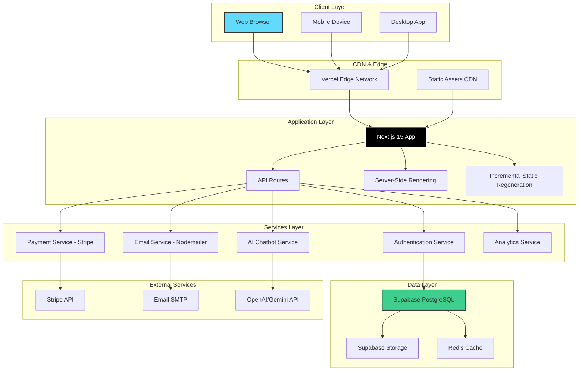
```mermaid
graph TB
    subgraph "Client Layer"
        WEB[Web Browser]
        MOB[Mobile Device]
        DESK[Desktop App]
    end
    
    subgraph "CDN & Edge"
        VERCEL[Vercel Edge Network]
        CDN[Static Assets CDN]
    end
    
    subgraph "Application Layer"
        NEXT[Next.js 15 App]
        API[API Routes]
        SSR[Server-Side Rendering]
        ISR[Incremental Static Regeneration]
    end
    
    subgraph "Services Layer"
        AUTH[Authentication Service]
        PAYMENT[Payment Service - Stripe]
        EMAIL[Email Service - Nodemailer]
        AI[AI Chatbot Service]
        ANALYTICS[Analytics Service]
    end
    
    subgraph "Data Layer"
        SUPABASE[Supabase PostgreSQL]
        STORAGE[Supabase Storage]
        CACHE[Redis Cache]
    end
    
    subgraph "External Services"
        STRIPE[Stripe API]
        SMTP[Email SMTP]
        OPENAI[OpenAI/Gemini API]
    end
    
    WEB --> VERCEL
    MOB --> VERCEL
    DESK --> VERCEL
    
    VERCEL --> NEXT
    CDN --> NEXT
    
    NEXT --> API
    NEXT --> SSR
    NEXT --> ISR
    
    API --> AUTH
    API --> PAYMENT
    API --> EMAIL
    API --> AI
    API --> ANALYTICS
    
    AUTH --> SUPABASE
    PAYMENT --> STRIPE
    EMAIL --> SMTP
    AI --> OPENAI
    
    SUPABASE --> STORAGE
    SUPABASE --> CACHE
    
    style WEB fill:#61dafb,stroke:#333,stroke-width:2px
    style NEXT fill:#000000,stroke:#fff,stroke-width:2px,color:#fff
    style SUPABASE fill:#3ecf8e,stroke:#333,stroke-width:2px
```

---

## 🔐 Authentication Flow

### User Login & Session Management

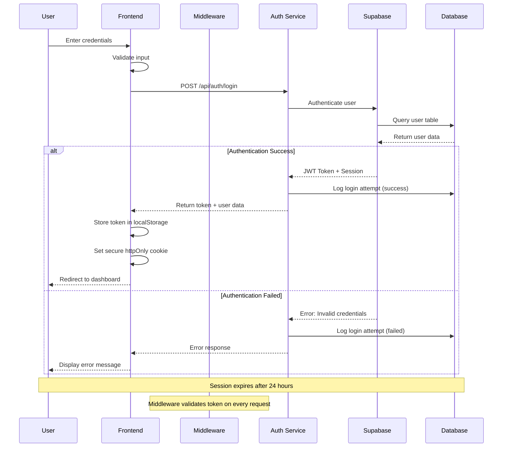
```mermaid
sequenceDiagram
    participant User
    participant Frontend
    participant Middleware
    participant Auth Service
    participant Supabase
    participant Database
    
    User->>Frontend: Enter credentials
    Frontend->>Frontend: Validate input
    Frontend->>Auth Service: POST /api/auth/login
    
    Auth Service->>Supabase: Authenticate user
    Supabase->>Database: Query user table
    Database-->>Supabase: Return user data
    
    alt Authentication Success
        Supabase-->>Auth Service: JWT Token + Session
        Auth Service->>Database: Log login attempt (success)
        Auth Service-->>Frontend: Return token + user data
        Frontend->>Frontend: Store token in localStorage
        Frontend->>Frontend: Set secure httpOnly cookie
        Frontend-->>User: Redirect to dashboard
    else Authentication Failed
        Supabase-->>Auth Service: Error: Invalid credentials
        Auth Service->>Database: Log login attempt (failed)
        Auth Service-->>Frontend: Error response
        Frontend-->>User: Display error message
    end
    
    Note over User,Database: Session expires after 24 hours
    Note over Middleware: Middleware validates token on every request
```

### Role-Based Access Control (RBAC)

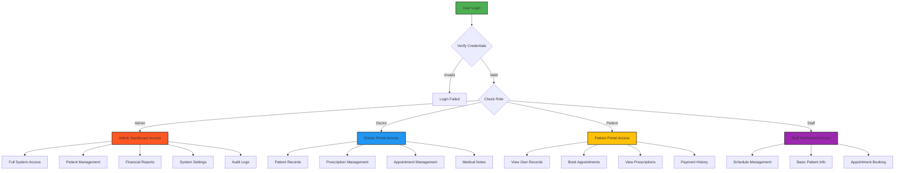
```mermaid
graph TD
    A[User Login] --> B{Verify Credentials}
    B -->|Invalid| C[Login Failed]
    B -->|Valid| D{Check Role}
    
    D -->|Admin| E[Admin Dashboard Access]
    D -->|Doctor| F[Doctor Portal Access]
    D -->|Patient| G[Patient Portal Access]
    D -->|Staff| H[Staff Dashboard Access]
    
    E --> E1[Full System Access]
    E --> E2[Patient Management]
    E --> E3[Financial Reports]
    E --> E4[System Settings]
    E --> E5[Audit Logs]
    
    F --> F1[Patient Records]
    F --> F2[Prescription Management]
    F --> F3[Appointment Management]
    F --> F4[Medical Notes]
    
    G --> G1[View Own Records]
    G --> G2[Book Appointments]
    G --> G3[View Prescriptions]
    G --> G4[Payment History]
    
    H --> H1[Schedule Management]
    H --> H2[Basic Patient Info]
    H --> H3[Appointment Booking]
    
    style A fill:#4CAF50,stroke:#333,stroke-width:2px
    style E fill:#FF5722,stroke:#333,stroke-width:2px
    style F fill:#2196F3,stroke:#333,stroke-width:2px
    style G fill:#FFC107,stroke:#333,stroke-width:2px
    style H fill:#9C27B0,stroke:#333,stroke-width:2px
```

---

## 📅 Appointment Booking Flow

### Complete Appointment Booking Process

```mermaid
flowchart TD
    START([Patient Initiates Booking]) --> CHECK_AUTH{Authenticated?}
    
    CHECK_AUTH -->|No| LOGIN[Redirect to Login]
    CHECK_AUTH -->|Yes| SELECT_DATE[Select Appointment Date]
    
    LOGIN --> SELECT_DATE
    
    SELECT_DATE --> EXCLUDE{Is Sunday?}
    EXCLUDE -->|Yes| SELECT_DATE
    EXCLUDE -->|No| CHECK_SLOTS[Fetch Available Time Slots]
    
    CHECK_SLOTS --> QUERY_DB[(Query Existing Appointments)]
    QUERY_DB --> CALCULATE[Calculate Available Slots<br/>8 AM - 6 PM]
    
    CALCULATE --> DISPLAY_SLOTS[Display Available Slots]
    DISPLAY_SLOTS --> SELECT_TIME[Patient Selects Time]
    
    SELECT_TIME --> SELECT_TYPE{Session Type?}
    SELECT_TYPE -->|In-Clinic| CLINIC[Set Type: In-Clinic]
    SELECT_TYPE -->|Video Call| VIDEO[Set Type: Video]
    
    CLINIC --> CHECK_CONFLICT
    VIDEO --> CHECK_CONFLICT{Time Conflict?}
    
    CHECK_CONFLICT -->|Yes| CONFLICT_WARNING[Show Conflict Warning]
    CONFLICT_WARNING --> SELECT_TIME
    
    CHECK_CONFLICT -->|No| ENTER_DETAILS[Enter Patient Details<br/>Name, Phone, Email, Notes]
    
    ENTER_DETAILS --> VALIDATE{Valid Data?}
    VALIDATE -->|No| ERROR[Show Validation Error]
    ERROR --> ENTER_DETAILS
    
    VALIDATE -->|Yes| CREATE_APPOINTMENT[(Create Appointment Record)]
    
    CREATE_APPOINTMENT --> SAVE_DB[(Save to Database)]
    SAVE_DB --> GENERATE_ID[Generate Patient Code]
    
    GENERATE_ID --> SEND_EMAIL[Send Confirmation Email]
    SEND_EMAIL --> SEND_SMS{SMS Enabled?}
    
    SEND_SMS -->|Yes| SMS_NOTIFY[Send SMS Notification]
    SEND_SMS -->|No| CALENDAR_REMINDER
    
    SMS_NOTIFY --> CALENDAR_REMINDER[Create Calendar Reminder]
    CALENDAR_REMINDER --> SHOW_CONFIRMATION[Display Confirmation Screen]
    
    SHOW_CONFIRMATION --> DOWNLOAD_PDF{Download PDF?}
    DOWNLOAD_PDF -->|Yes| GENERATE_PDF[Generate Confirmation PDF]
    DOWNLOAD_PDF -->|No| END
    
    GENERATE_PDF --> END([Booking Complete])
    
    style START fill:#4CAF50,stroke:#333,stroke-width:3px
    style END fill:#4CAF50,stroke:#333,stroke-width:3px
    style CREATE_APPOINTMENT fill:#2196F3,stroke:#333,stroke-width:2px
    style SEND_EMAIL fill:#FF9800,stroke:#333,stroke-width:2px
```

### Next Appointment Booking (Follow-Up)

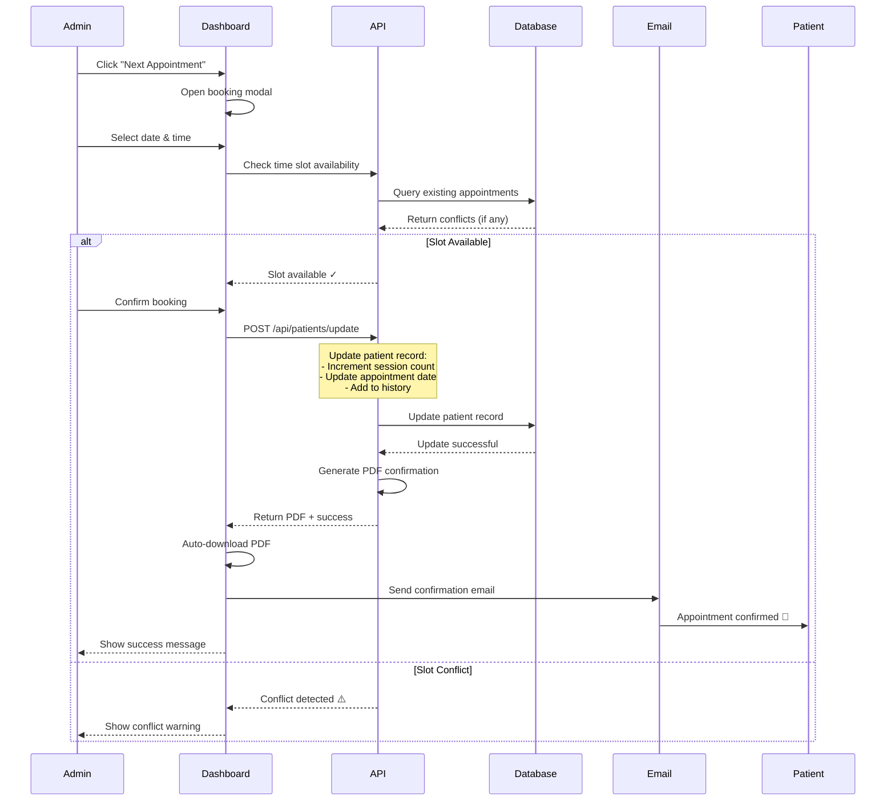
```mermaid
sequenceDiagram
    participant Admin
    participant Dashboard
    participant API
    participant DB as Database
    participant Email
    participant Patient
    
    Admin->>Dashboard: Click "Next Appointment"
    Dashboard->>Dashboard: Open booking modal
    Admin->>Dashboard: Select date & time
    
    Dashboard->>API: Check time slot availability
    API->>DB: Query existing appointments
    DB-->>API: Return conflicts (if any)
    
    alt Slot Available
        API-->>Dashboard: Slot available ✓
        Admin->>Dashboard: Confirm booking
        
        Dashboard->>API: POST /api/patients/update
        Note over API: Update patient record:<br/>- Increment session count<br/>- Update appointment date<br/>- Add to history
        
        API->>DB: Update patient record
        DB-->>API: Update successful
        
        API->>API: Generate PDF confirmation
        API-->>Dashboard: Return PDF + success
        
        Dashboard->>Dashboard: Auto-download PDF
        Dashboard->>Email: Send confirmation email
        Email->>Patient: Appointment confirmed 📧
        
        Dashboard-->>Admin: Show success message
    else Slot Conflict
        API-->>Dashboard: Conflict detected ⚠️
        Dashboard-->>Admin: Show conflict warning
    end
```

---

## 👤 Patient Management Flow

### Patient Registration & Record Creation

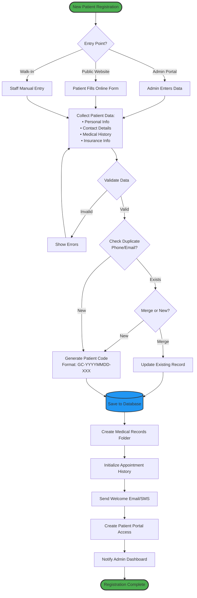
```mermaid
flowchart TD
    START([New Patient Registration]) --> SOURCE{Entry Point?}
    
    SOURCE -->|Admin Portal| ADMIN_ENTRY[Admin Enters Data]
    SOURCE -->|Public Website| PUBLIC_FORM[Patient Fills Online Form]
    SOURCE -->|Walk-In| WALK_IN[Staff Manual Entry]
    
    ADMIN_ENTRY --> FORM_DATA
    PUBLIC_FORM --> FORM_DATA
    WALK_IN --> FORM_DATA
    
    FORM_DATA[Collect Patient Data:<br/>• Personal Info<br/>• Contact Details<br/>• Medical History<br/>• Insurance Info] --> VALIDATE{Validate Data}
    
    VALIDATE -->|Invalid| ERROR[Show Errors]
    ERROR --> FORM_DATA
    
    VALIDATE -->|Valid| CHECK_DUPLICATE{Check Duplicate<br/>Phone/Email?}
    
    CHECK_DUPLICATE -->|Exists| MERGE_OPTION{Merge or New?}
    MERGE_OPTION -->|Merge| UPDATE_EXISTING[Update Existing Record]
    MERGE_OPTION -->|New| GENERATE_ID
    
    CHECK_DUPLICATE -->|New| GENERATE_ID[Generate Patient Code<br/>Format: GC-YYYYMMDD-XXX]
    
    UPDATE_EXISTING --> SAVE_DB
    GENERATE_ID --> SAVE_DB[(Save to Database)]
    
    SAVE_DB --> CREATE_FOLDER[Create Medical Records Folder]
    CREATE_FOLDER --> INIT_HISTORY[Initialize Appointment History]
    
    INIT_HISTORY --> SEND_WELCOME[Send Welcome Email/SMS]
    SEND_WELCOME --> CREATE_PORTAL[Create Patient Portal Access]
    
    CREATE_PORTAL --> NOTIFY_ADMIN[Notify Admin Dashboard]
    NOTIFY_ADMIN --> END([Registration Complete])
    
    style START fill:#4CAF50,stroke:#333,stroke-width:3px
    style END fill:#4CAF50,stroke:#333,stroke-width:3px
    style SAVE_DB fill:#2196F3,stroke:#333,stroke-width:2px
```

### Patient Data Flow

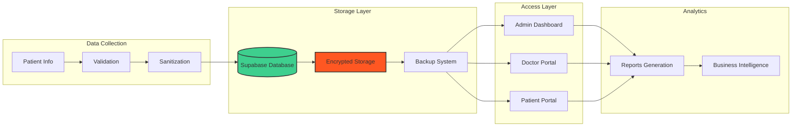
```mermaid
graph LR
    subgraph "Data Collection"
        A[Patient Info] --> B[Validation]
        B --> C[Sanitization]
    end
    
    subgraph "Storage Layer"
        C --> D[(Supabase Database)]
        D --> E[Encrypted Storage]
        E --> F[Backup System]
    end
    
    subgraph "Access Layer"
        F --> G[Admin Dashboard]
        F --> H[Doctor Portal]
        F --> I[Patient Portal]
    end
    
    subgraph "Analytics"
        G --> J[Reports Generation]
        H --> J
        I --> J
        J --> K[Business Intelligence]
    end
    
    style D fill:#3ecf8e,stroke:#333,stroke-width:2px
    style E fill:#FF5722,stroke:#333,stroke-width:2px
```

---

## 💊 Prescription Generation Flow

### Digital Prescription Creation & Management

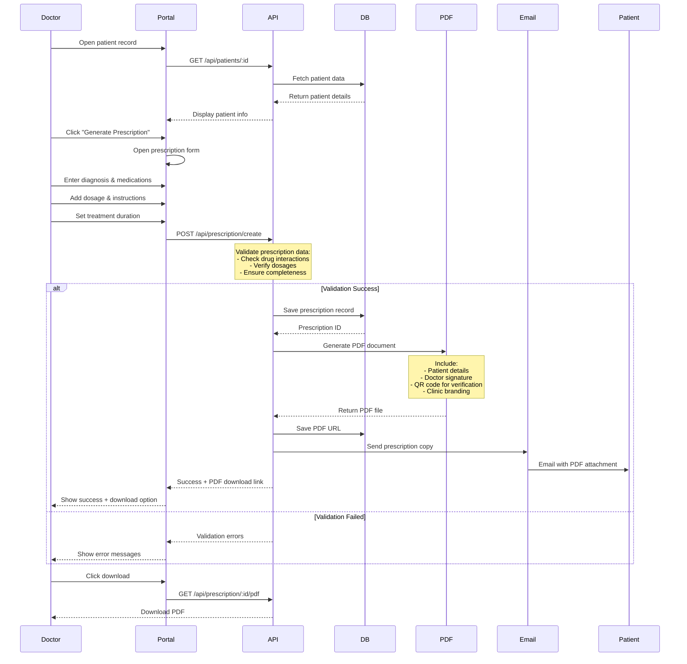
```mermaid
sequenceDiagram
    participant Doctor
    participant Portal
    participant API
    participant DB
    participant PDF
    participant Email
    participant Patient
    
    Doctor->>Portal: Open patient record
    Portal->>API: GET /api/patients/:id
    API->>DB: Fetch patient data
    DB-->>API: Return patient details
    API-->>Portal: Display patient info
    
    Doctor->>Portal: Click "Generate Prescription"
    Portal->>Portal: Open prescription form
    
    Doctor->>Portal: Enter diagnosis & medications
    Doctor->>Portal: Add dosage & instructions
    Doctor->>Portal: Set treatment duration
    
    Portal->>API: POST /api/prescription/create
    
    Note over API: Validate prescription data:<br/>- Check drug interactions<br/>- Verify dosages<br/>- Ensure completeness
    
    alt Validation Success
        API->>DB: Save prescription record
        DB-->>API: Prescription ID
        
        API->>PDF: Generate PDF document
        Note over PDF: Include:<br/>- Patient details<br/>- Doctor signature<br/>- QR code for verification<br/>- Clinic branding
        
        PDF-->>API: Return PDF file
        API->>DB: Save PDF URL
        
        API->>Email: Send prescription copy
        Email->>Patient: Email with PDF attachment
        
        API-->>Portal: Success + PDF download link
        Portal-->>Doctor: Show success + download option
        
    else Validation Failed
        API-->>Portal: Validation errors
        Portal-->>Doctor: Show error messages
    end
    
    Doctor->>Portal: Click download
    Portal->>API: GET /api/prescription/:id/pdf
    API-->>Doctor: Download PDF
```

---

## 📊 Admin Dashboard Flow

### Admin Dashboard Data Loading & Interaction

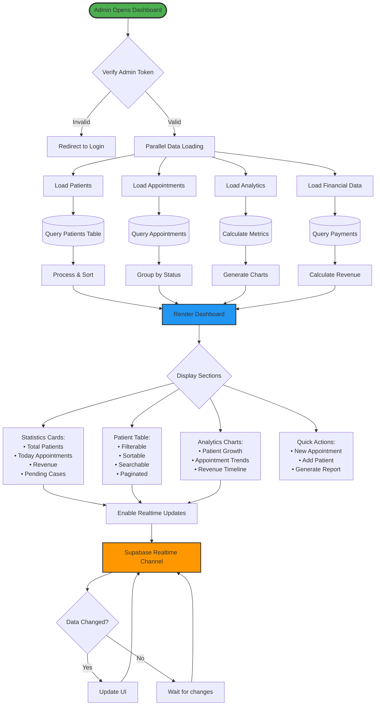
```mermaid
flowchart TD
    START([Admin Opens Dashboard]) --> AUTH{Verify Admin Token}
    
    AUTH -->|Invalid| LOGIN[Redirect to Login]
    AUTH -->|Valid| LOAD_PARALLEL
    
    LOAD_PARALLEL[Parallel Data Loading] --> LOAD1[Load Patients]
    LOAD_PARALLEL --> LOAD2[Load Appointments]
    LOAD_PARALLEL --> LOAD3[Load Analytics]
    LOAD_PARALLEL --> LOAD4[Load Financial Data]
    
    LOAD1 --> DB1[(Query Patients Table)]
    LOAD2 --> DB2[(Query Appointments)]
    LOAD3 --> DB3[(Calculate Metrics)]
    LOAD4 --> DB4[(Query Payments)]
    
    DB1 --> PROCESS1[Process & Sort]
    DB2 --> PROCESS2[Group by Status]
    DB3 --> PROCESS3[Generate Charts]
    DB4 --> PROCESS4[Calculate Revenue]
    
    PROCESS1 --> RENDER
    PROCESS2 --> RENDER
    PROCESS3 --> RENDER
    PROCESS4 --> RENDER[Render Dashboard]
    
    RENDER --> DISPLAY{Display Sections}
    
    DISPLAY --> STATS[Statistics Cards:<br/>• Total Patients<br/>• Today Appointments<br/>• Revenue<br/>• Pending Cases]
    
    DISPLAY --> TABLE[Patient Table:<br/>• Filterable<br/>• Sortable<br/>• Searchable<br/>• Paginated]
    
    DISPLAY --> CHARTS[Analytics Charts:<br/>• Patient Growth<br/>• Appointment Trends<br/>• Revenue Timeline]
    
    DISPLAY --> ACTIONS[Quick Actions:<br/>• New Appointment<br/>• Add Patient<br/>• Generate Report]
    
    STATS --> REALTIME[Enable Realtime Updates]
    TABLE --> REALTIME
    CHARTS --> REALTIME
    
    REALTIME --> WEBSOCKET[Supabase Realtime Channel]
    WEBSOCKET --> UPDATE{Data Changed?}
    
    UPDATE -->|Yes| REFRESH[Update UI]
    UPDATE -->|No| WAIT[Wait for changes]
    
    REFRESH --> WEBSOCKET
    WAIT --> WEBSOCKET
    
    style START fill:#4CAF50,stroke:#333,stroke-width:3px
    style RENDER fill:#2196F3,stroke:#333,stroke-width:2px
    style WEBSOCKET fill:#FF9800,stroke:#333,stroke-width:2px
```

---

## 🤖 AI Chatbot Flow

### Intelligent Medical Chatbot Conversation Flow

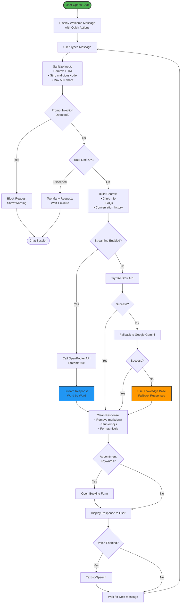
```mermaid
flowchart TD
    START([User Opens Chat]) --> WELCOME[Display Welcome Message<br/>with Quick Actions]
    
    WELCOME --> USER_INPUT[User Types Message]
    USER_INPUT --> SANITIZE[Sanitize Input:<br/>• Remove HTML<br/>• Strip malicious code<br/>• Max 500 chars]
    
    SANITIZE --> DETECT_INJECTION{Prompt Injection<br/>Detected?}
    
    DETECT_INJECTION -->|Yes| BLOCK[Block Request<br/>Show Warning]
    DETECT_INJECTION -->|No| CHECK_RATE{Rate Limit OK?}
    
    CHECK_RATE -->|Exceeded| RATE_ERROR[Too Many Requests<br/>Wait 1 minute]
    CHECK_RATE -->|OK| BUILD_CONTEXT
    
    BUILD_CONTEXT[Build Context:<br/>• Clinic info<br/>• FAQs<br/>• Conversation history] --> CHECK_STREAM{Streaming Enabled?}
    
    CHECK_STREAM -->|Yes| CALL_OPENROUTER
    CHECK_STREAM -->|No| CALL_XAI
    
    CALL_OPENROUTER[Call OpenRouter API<br/>Stream: true] --> STREAM_RESPONSE
    
    STREAM_RESPONSE[Stream Response<br/>Word by Word] --> CLEAN_MARKDOWN[Clean Response:<br/>• Remove markdown<br/>• Strip emojis<br/>• Format nicely]
    
    CALL_XAI[Try xAI Grok API] --> XAI_SUCCESS{Success?}
    
    XAI_SUCCESS -->|Yes| CLEAN_MARKDOWN
    XAI_SUCCESS -->|No| CALL_GEMINI[Fallback to Google Gemini]
    
    CALL_GEMINI --> GEMINI_SUCCESS{Success?}
    
    GEMINI_SUCCESS -->|Yes| CLEAN_MARKDOWN
    GEMINI_SUCCESS -->|No| USE_KNOWLEDGE[Use Knowledge Base<br/>Fallback Responses]
    
    USE_KNOWLEDGE --> CLEAN_MARKDOWN
    
    CLEAN_MARKDOWN --> CHECK_APPOINTMENT{Appointment<br/>Keywords?}
    
    CHECK_APPOINTMENT -->|Yes| OPEN_BOOKING[Open Booking Form]
    CHECK_APPOINTMENT -->|No| DISPLAY
    
    OPEN_BOOKING --> DISPLAY[Display Response to User]
    
    DISPLAY --> VOICE_ENABLED{Voice Enabled?}
    VOICE_ENABLED -->|Yes| SPEAK[Text-to-Speech]
    VOICE_ENABLED -->|No| WAIT_INPUT
    
    SPEAK --> WAIT_INPUT[Wait for Next Message]
    WAIT_INPUT --> USER_INPUT
    
    BLOCK --> END([Chat Session])
    RATE_ERROR --> END
    
    style START fill:#4CAF50,stroke:#333,stroke-width:3px
    style STREAM_RESPONSE fill:#2196F3,stroke:#333,stroke-width:2px
    style USE_KNOWLEDGE fill:#FF9800,stroke:#333,stroke-width:2px
```

### Chatbot AI Model Selection Flow

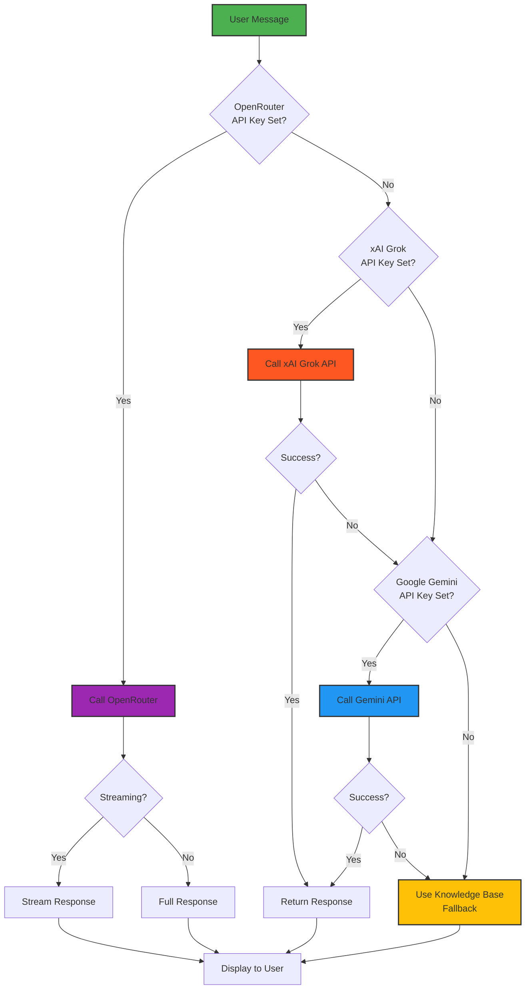
```mermaid
graph TD
    A[User Message] --> B{OpenRouter<br/>API Key Set?}
    
    B -->|Yes| C[Call OpenRouter]
    C --> C1{Streaming?}
    C1 -->|Yes| C2[Stream Response]
    C1 -->|No| C3[Full Response]
    
    B -->|No| D{xAI Grok<br/>API Key Set?}
    
    D -->|Yes| E[Call xAI Grok API]
    E --> E1{Success?}
    E1 -->|Yes| F[Return Response]
    E1 -->|No| G
    
    D -->|No| G{Google Gemini<br/>API Key Set?}
    
    G -->|Yes| H[Call Gemini API]
    H --> H1{Success?}
    H1 -->|Yes| F
    H1 -->|No| I
    
    G -->|No| I[Use Knowledge Base<br/>Fallback]
    
    C2 --> J[Display to User]
    C3 --> J
    F --> J
    I --> J
    
    style A fill:#4CAF50,stroke:#333,stroke-width:2px
    style C fill:#9C27B0,stroke:#333,stroke-width:2px
    style E fill:#FF5722,stroke:#333,stroke-width:2px
    style H fill:#2196F3,stroke:#333,stroke-width:2px
    style I fill:#FFC107,stroke:#333,stroke-width:2px
```

---

## 💳 Payment Processing Flow

### Stripe Payment Integration

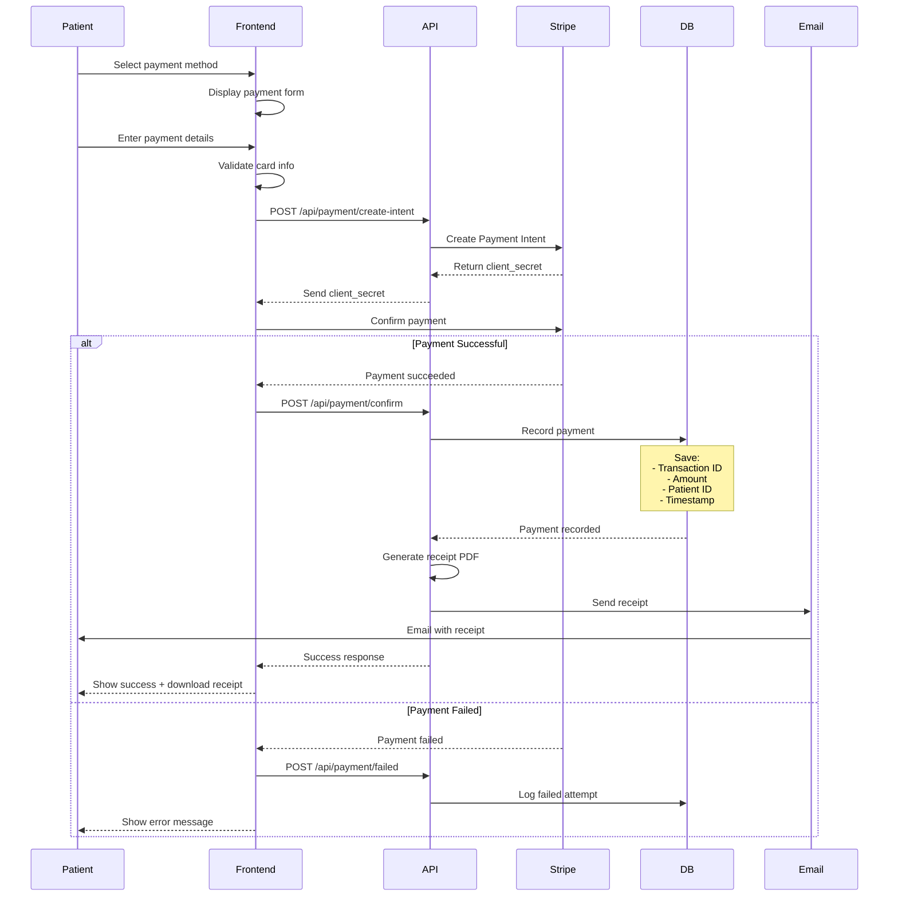
```mermaid
sequenceDiagram
    participant Patient
    participant Frontend
    participant API
    participant Stripe
    participant DB
    participant Email
    
    Patient->>Frontend: Select payment method
    Frontend->>Frontend: Display payment form
    
    Patient->>Frontend: Enter payment details
    Frontend->>Frontend: Validate card info
    
    Frontend->>API: POST /api/payment/create-intent
    API->>Stripe: Create Payment Intent
    Stripe-->>API: Return client_secret
    API-->>Frontend: Send client_secret
    
    Frontend->>Stripe: Confirm payment
    
    alt Payment Successful
        Stripe-->>Frontend: Payment succeeded
        Frontend->>API: POST /api/payment/confirm
        
        API->>DB: Record payment
        Note over DB: Save:<br/>- Transaction ID<br/>- Amount<br/>- Patient ID<br/>- Timestamp
        
        DB-->>API: Payment recorded
        
        API->>API: Generate receipt PDF
        API->>Email: Send receipt
        Email->>Patient: Email with receipt
        
        API-->>Frontend: Success response
        Frontend-->>Patient: Show success + download receipt
        
    else Payment Failed
        Stripe-->>Frontend: Payment failed
        Frontend->>API: POST /api/payment/failed
        API->>DB: Log failed attempt
        Frontend-->>Patient: Show error message
    end
```

---

## 📧 Email Notification Flow

### Automated Email System

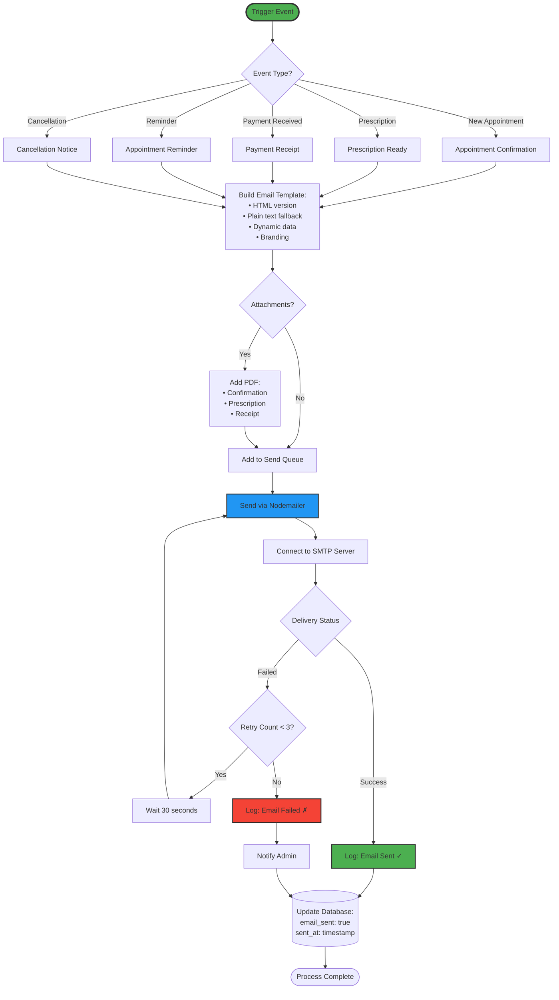
```mermaid
flowchart TD
    START([Trigger Event]) --> EVENT_TYPE{Event Type?}
    
    EVENT_TYPE -->|New Appointment| APPT_EMAIL
    EVENT_TYPE -->|Prescription| RX_EMAIL
    EVENT_TYPE -->|Payment Received| PAY_EMAIL
    EVENT_TYPE -->|Reminder| REMIND_EMAIL
    EVENT_TYPE -->|Cancellation| CANCEL_EMAIL
    
    APPT_EMAIL[Appointment Confirmation] --> BUILD_TEMPLATE
    RX_EMAIL[Prescription Ready] --> BUILD_TEMPLATE
    PAY_EMAIL[Payment Receipt] --> BUILD_TEMPLATE
    REMIND_EMAIL[Appointment Reminder] --> BUILD_TEMPLATE
    CANCEL_EMAIL[Cancellation Notice] --> BUILD_TEMPLATE
    
    BUILD_TEMPLATE[Build Email Template:<br/>• HTML version<br/>• Plain text fallback<br/>• Dynamic data<br/>• Branding] --> ATTACH{Attachments?}
    
    ATTACH -->|Yes| ADD_FILES[Add PDF:<br/>• Confirmation<br/>• Prescription<br/>• Receipt]
    ATTACH -->|No| QUEUE
    
    ADD_FILES --> QUEUE[Add to Send Queue]
    
    QUEUE --> SEND_EMAIL[Send via Nodemailer]
    
    SEND_EMAIL --> SMTP[Connect to SMTP Server]
    SMTP --> DELIVER{Delivery Status}
    
    DELIVER -->|Success| LOG_SUCCESS[Log: Email Sent ✓]
    DELIVER -->|Failed| RETRY{Retry Count < 3?}
    
    RETRY -->|Yes| WAIT[Wait 30 seconds]
    WAIT --> SEND_EMAIL
    
    RETRY -->|No| LOG_FAILED[Log: Email Failed ✗]
    LOG_FAILED --> NOTIFY_ADMIN[Notify Admin]
    
    LOG_SUCCESS --> UPDATE_DB[(Update Database:<br/>email_sent: true<br/>sent_at: timestamp)]
    
    NOTIFY_ADMIN --> UPDATE_DB
    UPDATE_DB --> END([Process Complete])
    
    style START fill:#4CAF50,stroke:#333,stroke-width:3px
    style SEND_EMAIL fill:#2196F3,stroke:#333,stroke-width:2px
    style LOG_SUCCESS fill:#4CAF50,stroke:#333,stroke-width:2px
    style LOG_FAILED fill:#F44336,stroke:#333,stroke-width:2px
```

---

## 🔒 Security & Bot Protection Flow

### Multi-Layer Security System

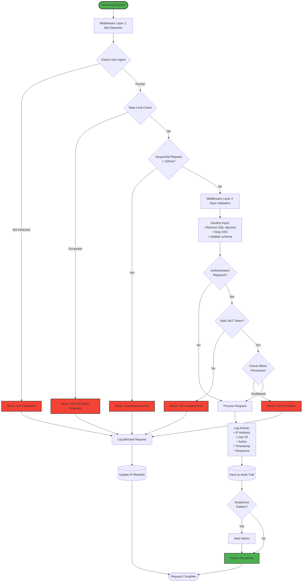
```mermaid
flowchart TD
    START([Incoming Request]) --> MIDDLEWARE1[Middleware Layer 1:<br/>Bot Detection]
    
    MIDDLEWARE1 --> CHECK_UA{Check User Agent}
    CHECK_UA -->|Bot Detected| BLOCK1[Block: 403 Forbidden]
    CHECK_UA -->|Human| CHECK_RATE
    
    CHECK_RATE{Rate Limit Check} -->|Exceeded| BLOCK2[Block: 429 Too Many Requests]
    CHECK_RATE -->|OK| CHECK_SEQ
    
    CHECK_SEQ{Sequential Request<br/>< 100ms?} -->|Yes| BLOCK3[Block: Suspicious Activity]
    CHECK_SEQ -->|No| MIDDLEWARE2
    
    MIDDLEWARE2[Middleware Layer 2:<br/>Input Validation] --> SANITIZE[Sanitize Input:<br/>• Remove SQL injection<br/>• Strip XSS<br/>• Validate schema]
    
    SANITIZE --> CHECK_AUTH{Authentication<br/>Required?}
    
    CHECK_AUTH -->|No| PROCESS
    CHECK_AUTH -->|Yes| VERIFY_TOKEN{Valid JWT Token?}
    
    VERIFY_TOKEN -->|No| BLOCK4[Block: 401 Unauthorized]
    VERIFY_TOKEN -->|Yes| CHECK_ROLE{Check RBAC<br/>Permission}
    
    CHECK_ROLE -->|Denied| BLOCK5[Block: 403 Forbidden]
    CHECK_ROLE -->|Allowed| PROCESS[Process Request]
    
    PROCESS --> LOG[Log Activity:<br/>• IP Address<br/>• User ID<br/>• Action<br/>• Timestamp<br/>• Response]
    
    LOG --> AUDIT[(Save to Audit Trail)]
    AUDIT --> MONITOR{Suspicious<br/>Pattern?}
    
    MONITOR -->|Yes| ALERT[Alert Admin]
    MONITOR -->|No| SUCCESS
    
    ALERT --> SUCCESS[Return Response]
    
    BLOCK1 --> LOG_BLOCK[Log Blocked Request]
    BLOCK2 --> LOG_BLOCK
    BLOCK3 --> LOG_BLOCK
    BLOCK4 --> LOG_BLOCK
    BLOCK5 --> LOG_BLOCK
    
    LOG_BLOCK --> UPDATE_BLACKLIST[(Update IP Blacklist)]
    
    SUCCESS --> END([Request Complete])
    UPDATE_BLACKLIST --> END
    
    style START fill:#4CAF50,stroke:#333,stroke-width:3px
    style BLOCK1 fill:#F44336,stroke:#333,stroke-width:2px
    style BLOCK2 fill:#F44336,stroke:#333,stroke-width:2px
    style BLOCK3 fill:#F44336,stroke:#333,stroke-width:2px
    style BLOCK4 fill:#F44336,stroke:#333,stroke-width:2px
    style BLOCK5 fill:#F44336,stroke:#333,stroke-width:2px
    style SUCCESS fill:#4CAF50,stroke:#333,stroke-width:2px
```

### Client-Side Security Measures

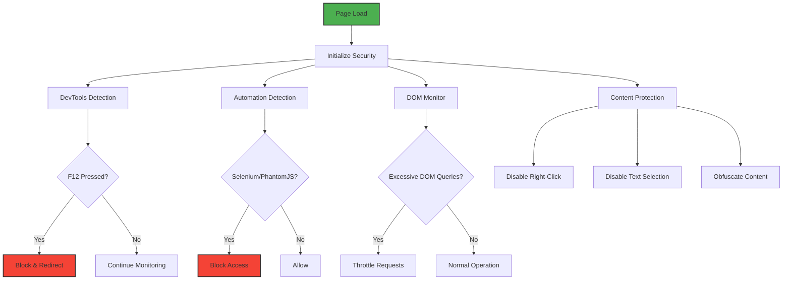
```mermaid
graph TD
    A[Page Load] --> B[Initialize Security]
    
    B --> C[DevTools Detection]
    B --> D[Automation Detection]
    B --> E[DOM Monitor]
    B --> F[Content Protection]
    
    C --> C1{F12 Pressed?}
    C1 -->|Yes| C2[Block & Redirect]
    C1 -->|No| C3[Continue Monitoring]
    
    D --> D1{Selenium/PhantomJS?}
    D1 -->|Yes| D2[Block Access]
    D1 -->|No| D3[Allow]
    
    E --> E1{Excessive DOM Queries?}
    E1 -->|Yes| E2[Throttle Requests]
    E1 -->|No| E3[Normal Operation]
    
    F --> F1[Disable Right-Click]
    F --> F2[Disable Text Selection]
    F --> F3[Obfuscate Content]
    
    style A fill:#4CAF50,stroke:#333,stroke-width:2px
    style C2 fill:#F44336,stroke:#333,stroke-width:2px
    style D2 fill:#F44336,stroke:#333,stroke-width:2px
```

---

## 📈 Analytics & Monitoring Flow

### Real-Time Analytics Pipeline

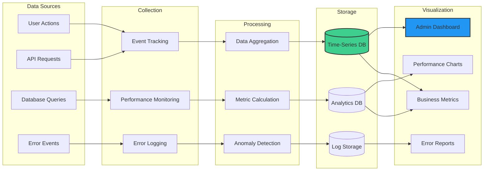
```mermaid
flowchart LR
    subgraph "Data Sources"
        A1[User Actions]
        A2[API Requests]
        A3[Database Queries]
        A4[Error Events]
    end
    
    subgraph "Collection"
        B1[Event Tracking]
        B2[Performance Monitoring]
        B3[Error Logging]
    end
    
    subgraph "Processing"
        C1[Data Aggregation]
        C2[Metric Calculation]
        C3[Anomaly Detection]
    end
    
    subgraph "Storage"
        D1[(Time-Series DB)]
        D2[(Analytics DB)]
        D3[(Log Storage)]
    end
    
    subgraph "Visualization"
        E1[Admin Dashboard]
        E2[Performance Charts]
        E3[Error Reports]
        E4[Business Metrics]
    end
    
    A1 --> B1
    A2 --> B1
    A3 --> B2
    A4 --> B3
    
    B1 --> C1
    B2 --> C2
    B3 --> C3
    
    C1 --> D1
    C2 --> D2
    C3 --> D3
    
    D1 --> E1
    D2 --> E2
    D3 --> E3
    D1 --> E4
    D2 --> E4
    
    style D1 fill:#3ecf8e,stroke:#333,stroke-width:2px
    style E1 fill:#2196F3,stroke:#333,stroke-width:2px
```

---

## 🗄️ Database Schema Overview

### Core Database Relationships

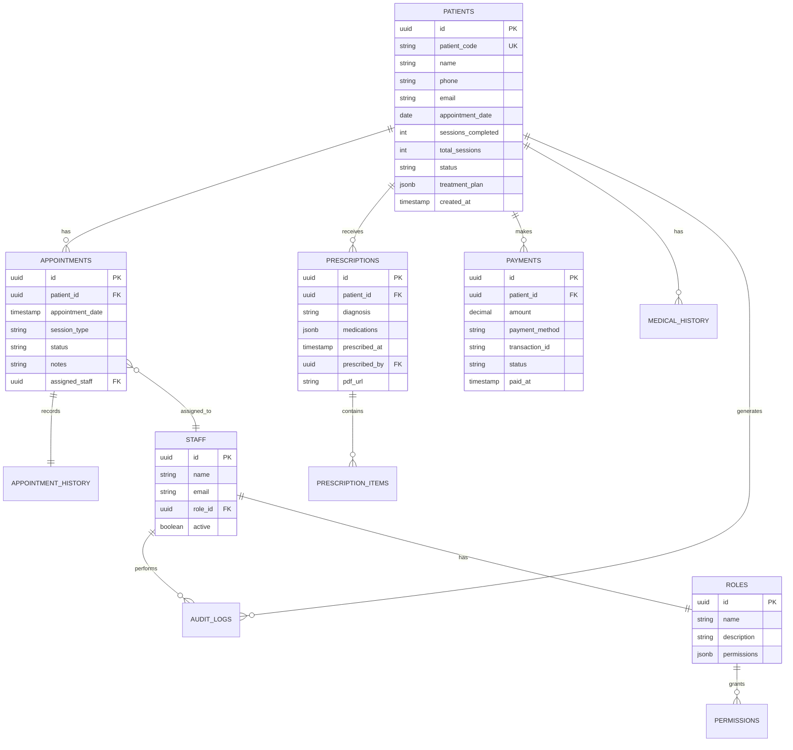
```mermaid
erDiagram
    PATIENTS ||--o{ APPOINTMENTS : has
    PATIENTS ||--o{ PRESCRIPTIONS : receives
    PATIENTS ||--o{ PAYMENTS : makes
    PATIENTS ||--o{ MEDICAL_HISTORY : has
    PATIENTS ||--o{ AUDIT_LOGS : generates
    
    APPOINTMENTS ||--|| APPOINTMENT_HISTORY : records
    APPOINTMENTS }o--|| STAFF : assigned_to
    
    PRESCRIPTIONS ||--o{ PRESCRIPTION_ITEMS : contains
    
    STAFF ||--o{ AUDIT_LOGS : performs
    STAFF ||--|| ROLES : has
    
    ROLES ||--o{ PERMISSIONS : grants
    
    PATIENTS {
        uuid id PK
        string patient_code UK
        string name
        string phone
        string email
        date appointment_date
        int sessions_completed
        int total_sessions
        string status
        jsonb treatment_plan
        timestamp created_at
    }
    
    APPOINTMENTS {
        uuid id PK
        uuid patient_id FK
        timestamp appointment_date
        string session_type
        string status
        string notes
        uuid assigned_staff FK
    }
    
    PRESCRIPTIONS {
        uuid id PK
        uuid patient_id FK
        string diagnosis
        jsonb medications
        timestamp prescribed_at
        uuid prescribed_by FK
        string pdf_url
    }
    
    PAYMENTS {
        uuid id PK
        uuid patient_id FK
        decimal amount
        string payment_method
        string transaction_id
        string status
        timestamp paid_at
    }
    
    STAFF {
        uuid id PK
        string name
        string email
        uuid role_id FK
        boolean active
    }
    
    ROLES {
        uuid id PK
        string name
        string description
        jsonb permissions
    }
```

---

## 📱 Mobile Responsiveness Flow

### Responsive Design Adaptation

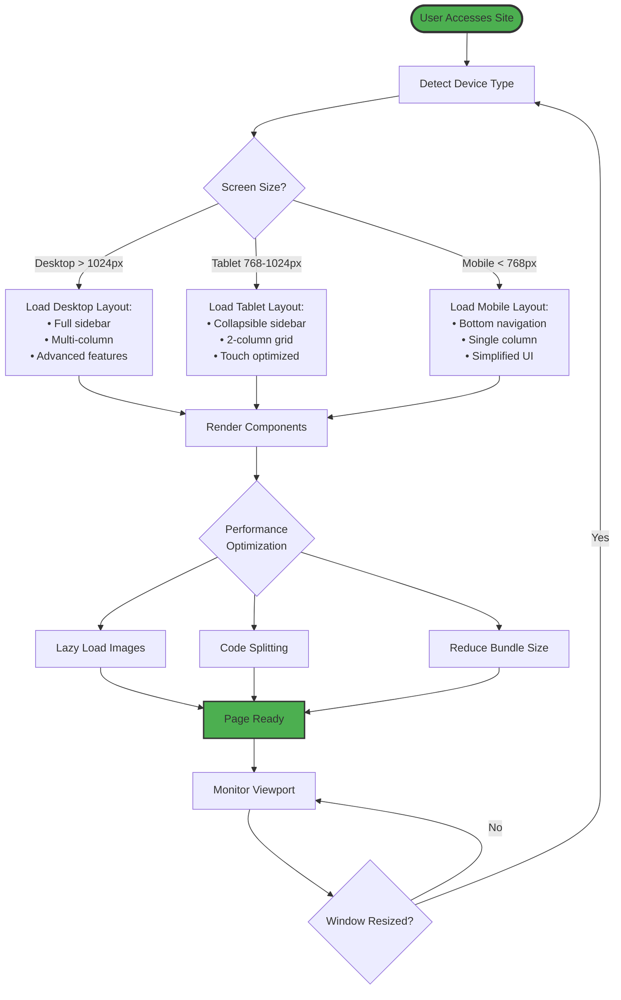
```mermaid
flowchart TD
    START([User Accesses Site]) --> DETECT[Detect Device Type]
    
    DETECT --> SCREEN{Screen Size?}
    
    SCREEN -->|Desktop > 1024px| DESKTOP[Load Desktop Layout:<br/>• Full sidebar<br/>• Multi-column<br/>• Advanced features]
    
    SCREEN -->|Tablet 768-1024px| TABLET[Load Tablet Layout:<br/>• Collapsible sidebar<br/>• 2-column grid<br/>• Touch optimized]
    
    SCREEN -->|Mobile < 768px| MOBILE[Load Mobile Layout:<br/>• Bottom navigation<br/>• Single column<br/>• Simplified UI]
    
    DESKTOP --> RENDER
    TABLET --> RENDER
    MOBILE --> RENDER
    
    RENDER[Render Components] --> OPTIMIZE{Performance<br/>Optimization}
    
    OPTIMIZE --> OPT1[Lazy Load Images]
    OPTIMIZE --> OPT2[Code Splitting]
    OPTIMIZE --> OPT3[Reduce Bundle Size]
    
    OPT1 --> READY
    OPT2 --> READY
    OPT3 --> READY[Page Ready]
    
    READY --> MONITOR[Monitor Viewport]
    MONITOR --> RESIZE{Window Resized?}
    
    RESIZE -->|Yes| DETECT
    RESIZE -->|No| MONITOR
    
    style START fill:#4CAF50,stroke:#333,stroke-width:3px
    style READY fill:#4CAF50,stroke:#333,stroke-width:2px
```

---

## 🔄 Data Synchronization Flow

### Real-Time Data Sync with Supabase

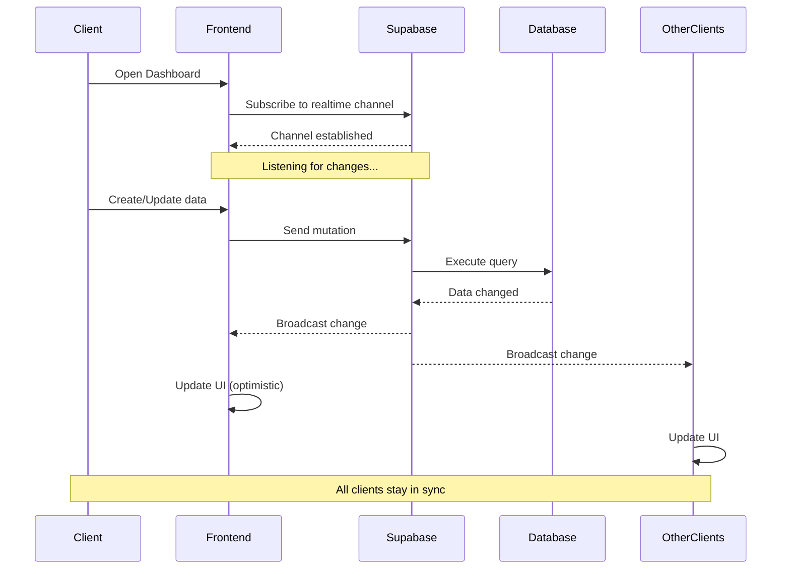
```mermaid
sequenceDiagram
    participant Client
    participant Frontend
    participant Supabase
    participant Database
    participant OtherClients
    
    Client->>Frontend: Open Dashboard
    Frontend->>Supabase: Subscribe to realtime channel
    Supabase-->>Frontend: Channel established
    
    Note over Frontend,Supabase: Listening for changes...
    
    Client->>Frontend: Create/Update data
    Frontend->>Supabase: Send mutation
    Supabase->>Database: Execute query
    
    Database-->>Supabase: Data changed
    Supabase-->>Frontend: Broadcast change
    Supabase-->>OtherClients: Broadcast change
    
    Frontend->>Frontend: Update UI (optimistic)
    OtherClients->>OtherClients: Update UI
    
    Note over Client,OtherClients: All clients stay in sync
```

---

## 🎯 Summary

These flowcharts represent the complete architecture and workflows of the Gonstead Chiropractic Management System. Each diagram shows:

✅ **Clear process flows** from start to finish  
✅ **Decision points** and error handling  
✅ **Integration points** between systems  
✅ **Security checkpoints** throughout  
✅ **Data flow** across layers  

For implementation details, see the [main documentation](./docs/README.md).

---

**Built with ❤️ for Modern Healthcare**

*Last Updated: January 2025*

